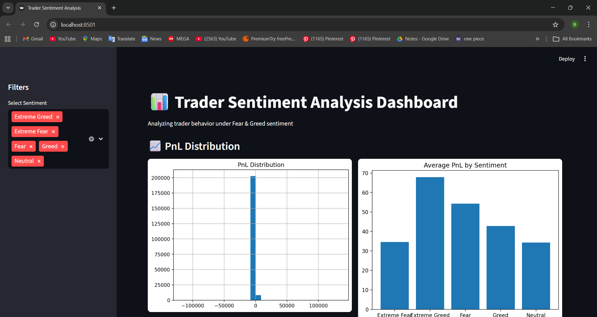
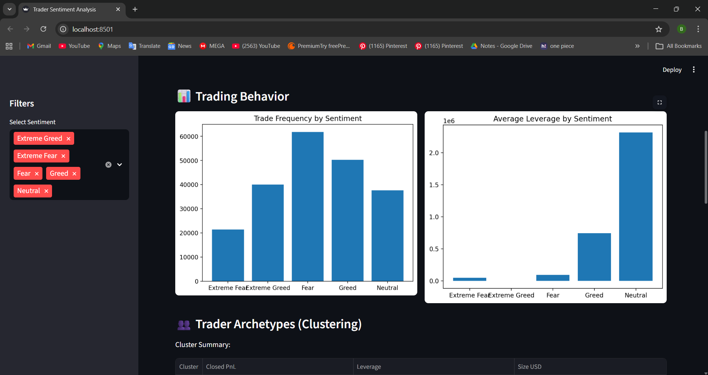
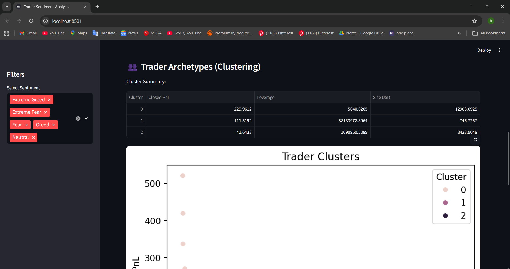
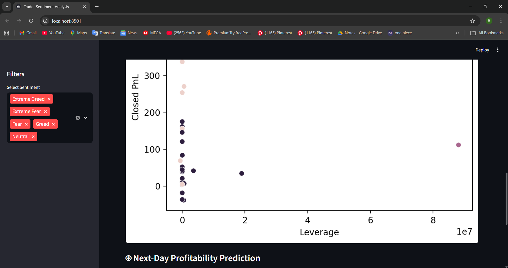
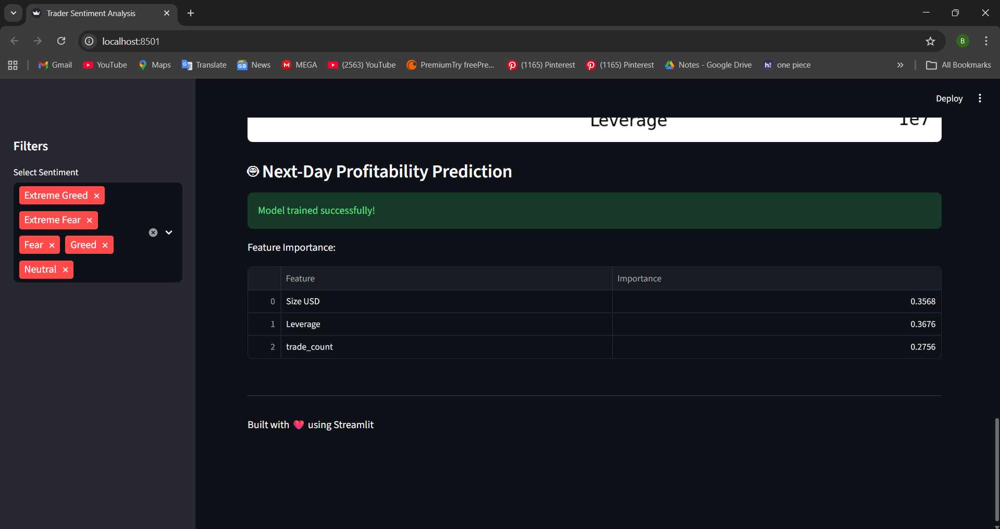

# 📊 Trader Sentiment Analysis & Behavioral Modeling

An end-to-end data science project analyzing how market sentiment (Fear & Greed Index) impacts trader performance, behavior, and risk-taking patterns.

This project includes:

- Data preprocessing & feature engineering
- Performance analysis under different sentiment regimes
- Trader segmentation using clustering
- A predictive model for next-day profitability
- An interactive Streamlit dashboard

---

## 🚀 Project Overview

Financial markets are heavily influenced by sentiment. This project explores:

- Does trader performance differ between Fear and Greed days?
- Do traders change leverage, trade frequency, or position size based on sentiment?
- Can we segment traders into behavioral archetypes?
- Can we predict next-day profitability using behavioral + sentiment features?

---

## 🔎 Part A – Data Preparation

- Loaded trading history and Fear & Greed Index
- Cleaned timestamps and aligned on daily basis
- Created:
  - Daily PnL per trader
  - Win rate
  - Leverage
  - Trade frequency
  - Long/Short ratio

---

## 📈 Part B – Analysis

We analyzed:

### 1️⃣ Performance under Fear vs Greed
- Average PnL
- Win rate
- Drawdown proxy

### 2️⃣ Behavioral Changes
- Trade frequency
- Leverage usage
- Position sizing
- Long/Short bias

### 3️⃣ Trader Segmentation
- High vs Low leverage traders
- Frequent vs Infrequent traders
- Consistent vs Inconsistent performers

Key insights were derived using charts and aggregated statistics.

---

## 💡 Part C – Actionable Strategy Ideas

Examples:

- Reduce leverage during Fear days for high-risk traders
- Increase position size during Greed days only for consistent winners
- Adjust long/short exposure based on sentiment regime

---

## 🤖 Part D – Advanced Modeling

### 🔮 Predictive Model
A Random Forest classifier predicts next-day profitability bucket using:

- Sentiment
- Trade frequency
- Position size
- Leverage

### 👥 Trader Clustering
KMeans clustering identifies behavioral archetypes:

- High-risk aggressive traders
- Stable moderate traders
- Low activity traders

---

## 📊 Streamlit Dashboard

An interactive dashboard allows:

- Sentiment filtering
- PnL visualization
- Behavioral comparison
- Cluster exploration
- Model training + feature importance display

---

## 📷 Dashboard Preview

<h3 align="center">Main Dashboard</h3>
<p align="center">
  
</p>

---

<h3 align="center">📊 Sentiment & Performance Analysis</h3>
<p align="center">
  
  
</p>

---

<h3 align="center">👥 Clustering & Predictive Modeling</h3>
<p align="center">
  
  
</p>

---

## 🛠 Tech Stack

- Python
- Pandas
- NumPy
- Scikit-Learn
- Matplotlib
- Seaborn
- Streamlit

---

## ⚙️ How to Run Locally

```bash
git clone <https://github.com/jwecodes/trader-vs-sentiment.git>
cd trader-vs-sentiment
pip install -r requirements.txt
python -m streamlit run app.py
App will open at: http://localhost:8501